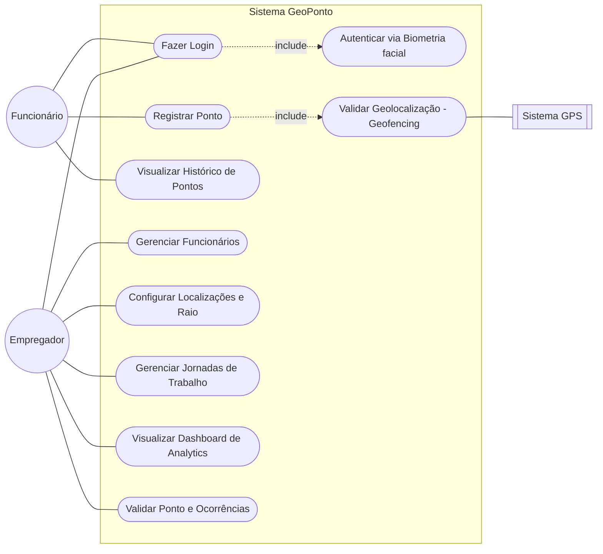
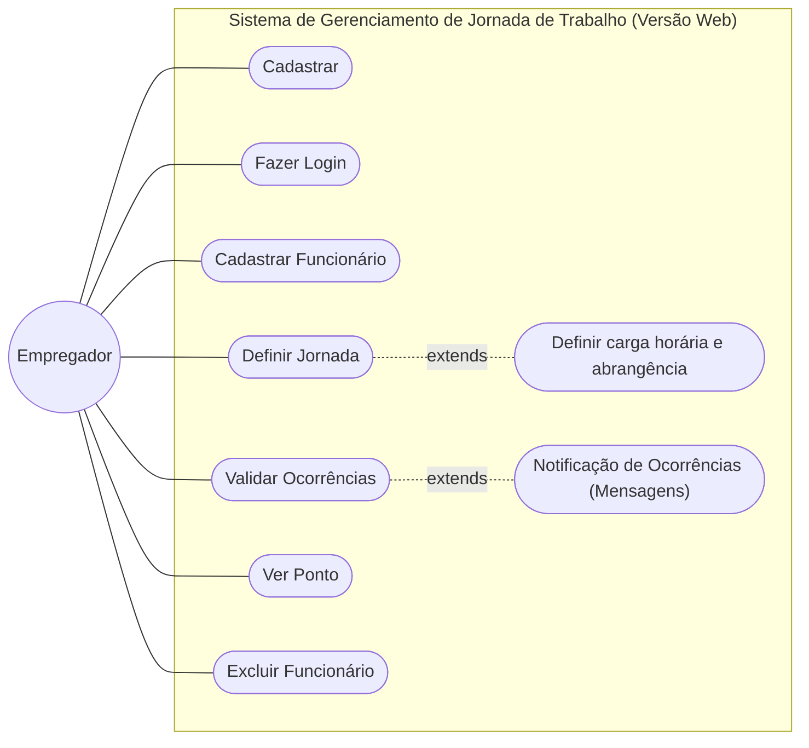

# GeoPonto - Sistema de Controle de Ponto por Geolocalização

Sistema de controle de ponto para funcionários, que utiliza geolocalização para registro e acompanhamento de jornada de trabalho. Este projeto está sendo desenvolvido como Trabalho de Conclusão de Curso (TCC) para a graduação de Desenvolvimento de Softwares Multiplataforma (DSM) da FATEC Franca.

## 💻 Tecnologias

# App

* **Frontend:** Flutter
* **Backend:** Python
* **Banco de Dados:** PostgreSQL
* **Controle de Versão:** Git e GitHub

# Web

* **Frontend:** Flutter
* **Backend:** Node.js
* **Banco de Dados:** PostgreSQL
* **Controle de Versão:** Git e GitHub


## 🚀 Funcionalidades

* Registro de ponto com base na geolocalização do usuário.
* Validação de presença dentro de um raio de 50 metros do local de trabalho.
* Cadastro e gerenciamento de usuários e empresas.
* Relatórios de horas trabalhadas e faltas.
* Autenticação e autorização de usuários.

## Escopo

* **App Mobile - Frente Empregado:** Interface para registro de jornada com biometria facial e geolocalização, 
além de consulta ao espelho de ponto individual.
* **App Mobile - Frente Empregador:** Ferramenta de gestão rápida para supervisores "em campo", permitindo 
o cadastro de novos funcionários via app.
* **Painel Web - Frente Empregador (Admin):** Ambiente de governança profunda, utilizado para configurações globais, 
gestão de cadastros e tratamento de inconsistências. 

## 📋 Modelagem de Casos de Uso

O diagrama abaixo descreve as principais interações entre os usuários (Funcionários e Empregadores) e o sistema GeoPonto.

## Versão App



## Versão Web


    

### Detalhes dos Casos de Uso
*   **Autenticação de Dois Fatores (2FA):** O caso de uso "Fazer Login" inclui obrigatoriamente a "Autenticação via Biometria", garantindo a identidade do colaborador.
*   **Geofencing:** O "Registro de Ponto" depende da "Validação de Geolocalização", que consome dados em tempo real do GPS para confirmar se o funcionário está dentro do raio permitido.
*   **Gestão Administrativa:** O Empregador possui permissões exclusivas para configurar os parâmetros de controle (geocercas e jornadas) e analisar métricas de produtividade.

## 📋 Requisitos do Sistema

Para o cumprimento das metas do Projeto Integrador, o sistema foi delimitado pelos seguintes requisitos:

### Requisitos Funcionais Mobile (RF)
| ID | Descrição | Ator |
| :--- | :--- | :--- |
| **RF01** | Autenticação por Dois Fatores (2FA) via senha e biometria facial. | Funcionário |
| **RF02** | Registro de ponto com captura automática de coordenadas GPS. | Funcionário |
| **RF03** | Validação automática de Geofencing (raio permitido) para registro. | Sistema |
| **RF04** | Visualização de espelho de ponto e histórico de registros. | Funcionário |
| **RF05** | Gestão de funcionários, empresas e jornadas (Interface Web). | Empregador |
| **RF06** | Configuração de perímetros de trabalho e raios de tolerância (Interface Web). | Empregador |
| **RF07** | Validação e tratamento de ocorrências de ponto (Interface Web). | Empregador |
| **RF08** | Notificação de registros e pendências via serviço de mensageria. | Sistema |


### Requisitos Funcionais Web - Foco no Empregador (RF)

| ID | Descrição | Ator |
| :--- | :--- | :--- |
| **RF09** | Cadastrar Novo Usuário com validação de identidade via IA antes de cada marcação. | Empregador |
| **RF10** | Gerir Funcionário: controle centralizado de perfis e acessos. | Empregador |
| **RF10.1** | Definir Jornada do Funcionário: definição da carga horária personalizada por funcionário. | Empregador |
| **RF10.2** | Alterar Dados Cadastrais do Funcionário: alteração de endereço, e-mail, etc. | Empregador |
| **RF10.3** | Ver Ponto: visualização das marcações de ponto por funcionário. | Empregador |
| **RF10.4** | Excluir Funcionário: exclusão do perfil do funcionário do sistema. | Empregador |
| **RF11** | Receber Mensagem de Notificação de Ocorrência: avisos via mensageria sobre ocorrências e solicitações. | Empregador |
| **RF12** | Validar ocorrências: avaliação de situações atípicas na jornada de trabalho. | Empregador |
| **RF12.1** | Acessar marcações de pontos de não conformidade: validação de marcações fora dos parâmetros definidos. | Empregador |
| **RF12.2** | Acessar Atestados/Justificativas: validação de documentos como atestados e justificativas de ausência. | Empregador |

### Requisitos Não Funcionais (RNF)
| ID | Descrição | Categoria |
| :--- | :--- | :--- |
| **RNF01** | Acurácia da biometria facial deve ser superior a 80%. | Segurança |
| **RNF02** | O extrator de características faciais deve ser treinado do zero (Weights=None). | Acadêmico |
| **RNF03** | Interface do funcionário deve ser Mobile (Android/iOS). | Portabilidade |
| **RNF04** | Interface do empregador deve ser Web (Browser). | Acessibilidade |
| **RNF05** | Tempo de inferência da biometria no App não deve exceder 3 segundos. | Performance |
| **RNF06** | Backend hospedado em nuvem (VM Azure) para alta disponibilidade. | Infraestrutura |
| **RNF07** | Uso de PostgreSQL para persistência de dados georreferenciados. | Robustez |

## 🎨 Protótipos no Figma

Acesse os designs e o protótipo navegável do GeoPonto através dos links abaixo:

[](https://www.figma.com/design/PQE2Dk9cWi9V3rwjqzMBWr/GeoPonto?node-id=0-1&t=xtbLx2VCTzRkc8VK-1)

[](https://www.figma.com/make/LGVx7yChBPbCld9NhvVxpg/GeoPonto-Web-App-Prototype?fullscreen=1&t=EXGogwnShySCRRbu-1)

## 🛠️ Como Rodar o Projeto

**Pré-requisitos:**

Certifique-se de ter as seguintes ferramentas instaladas:

* [Python 3.8+](https://www.python.org/downloads/)
* [Flutter SDK](https://flutter.dev/docs/get-started/install)
* [pip](https://pip.pypa.io/en/stable/installing/)

**Instruções:**

1.  **Clone o repositório:**
    ```bash
    git clone [https://github.com/ThiagoResende88/GeoPonto_fatec.git](https://github.com/ThiagoResende88/GeoPonto_fatec.git)
    ```
2.  **Acesse a pasta do projeto:**
    ```bash
    cd GeoPonto_fatec
    ```
3.  **Configurar o Banco de Dados e Backend:**

    * A configuração do banco de dados (PostgreSQL) e do ambiente Python agora é automatizada via scripts no diretório `/backend`.
    * Consulte o README interno da pasta `backend` para instruções detalhadas sobre o `setup_vm.sh`.

4.  **Rodar a aplicação Backend (Python):**

    * Acesse a pasta do backend:
      ```bash
      cd backend
      ```
    * Instale as dependências:
      ```bash
      pip install -r requirements.txt
      ```
    * Inicie a aplicação:
      ```bash
      python main.py
      ```

5.  **Rodar a aplicação Frontend (Flutter):**

    * Acesse a pasta do frontend:
      ```bash
      cd ../frontend
      ```
    * Baixe as dependências:
      ```bash
      flutter pub get
      ```
    * Inicie a aplicação em um emulador ou dispositivo conectado:
      ```bash
      flutter run
      ```

6.  **Acessar a API:**

    * A API estará disponível em `********`.
    * Você pode usar uma ferramenta como o Postman ou Insomnia para testar os endpoints.
  
## 📂 Estrutura do Projeto

* `/backend`: Contém o código-fonte da API em Python.
* `/frontend`: Contém o código-fonte da interface do usuário em Flutter.
* `/docs`: Documentação adicional do projeto.
* `/scripts`: Scripts para automação (CI/CD, deploy, etc.).

## 👥 Equipe

👨‍💻 Danilo Benedette — Design e Frontend | [LinkedIn](https://www.linkedin.com/in/danilo-benedetti-98161436b) · [GitHub](https://github.com/DanBenedetti) 

👨‍💻 Gustavo Santos— FullStack | [LinkedIn](https://www.linkedin.com/in/gustavo-moreira-santos-628857243/) · [GitHub](https://github.com/GustavoMSantoss)

👨‍💻 Thiago Resende — DevOps, Backend e Documentação | 
[LinkedIn](https://www.linkedin.com/in/thiagodiasresende/) · [GitHub](https://github.com/ThiagoResende88) 

👨‍💻 Wilton Monteiro — QA e UX Geral | [LinkedIn](https://www.linkedin.com/in/wilton-monteiro-resende-415631287/) · [GitHub](https://github.com/Wilton-Monteiro)
