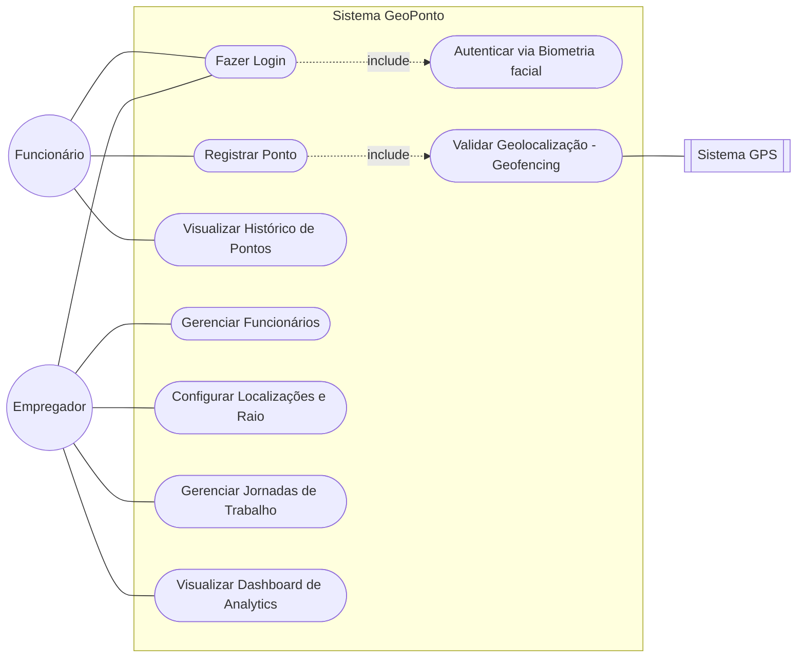

# GeoPonto - Sistema de Controle de Ponto por Geolocalização

Sistema de controle de ponto para funcionários, que utiliza geolocalização para registro e acompanhamento de jornada de trabalho. Este projeto está sendo desenvolvido como Trabalho de Conclusão de Curso (TCC) para a graduação de Desenvolvimento de Softwares Multiplataforma (DSM) da FATEC Franca.

## 💻 Tecnologias

* **Frontend:** Flutter
* **Backend:** Python
* **Banco de Dados:** PostgreSQL
* **Contêiner:** Docker
* **Controle de Versão:** Git e GitHub

## 🚀 Funcionalidades

* Registro de ponto com base na geolocalização do usuário.
* Validação de presença dentro de um raio de 50 metros do local de trabalho.
* Cadastro e gerenciamento de usuários e empresas.
* Relatórios de horas trabalhadas e faltas.
*   Autenticação e autorização de usuários.

## 📋 Modelagem de Casos de Uso

O diagrama abaixo descreve as principais interações entre os usuários (Funcionários e Empregadores) e o sistema GeoPonto.



### Detalhes dos Casos de Uso
*   **Autenticação de Dois Fatores (2FA):** O caso de uso "Fazer Login" inclui obrigatoriamente a "Autenticação via Biometria", garantindo a identidade do colaborador.
*   **Geofencing:** O "Registro de Ponto" depende da "Validação de Geolocalização", que consome dados em tempo real do GPS para confirmar se o funcionário está dentro do raio permitido.
*   **Gestão Administrativa:** O Empregador possui permissões exclusivas para configurar os parâmetros de controle (geocercas e jornadas) e analisar métricas de produtividade.

## 🛠️ Como Rodar o Projeto

**Pré-requisitos:**

Certifique-se de ter as seguintes ferramentas instaladas:

* [Python 3.8+](https://www.python.org/downloads/)
* [Flutter SDK](https://flutter.dev/docs/get-started/install)
* [Docker](https://www.docker.com/get-started)
* [Docker Compose](https://docs.docker.com/compose/install/)
* [pip](https://pip.pypa.io/en/stable/installing/)

**Instruções:**

1.  **Clone o repositório:**
    ```bash
    git clone [https://github.com/ThiagoResende88/GeoPonto_fatec.git](https://github.com/ThiagoResende88/GeoPonto_fatec.git)
    ```
2.  **Acesse a pasta do projeto:**
    ```bash
    cd GeoPonto_fatec
    ```
3.  **Configurar o Banco de Dados:**

    * Utilizaremos o Docker Compose para subir o banco de dados PostgreSQL.
    * Crie um arquivo `.env` na raiz do projeto e adicione as variáveis de ambiente necessárias (ex: `DB_USER`, `DB_PASSWORD`, `DB_NAME`).
    * Suba o contêiner do banco de dados:
        ```bash
        docker-compose up -d postgres
        ```

4.  **Rodar a aplicação Backend (Python):**

    * Acesse a pasta do backend:
      ```bash
      cd backend
      ```
    * Instale as dependências:
      ```bash
      pip install -r requirements.txt
      ```
    * Inicie a aplicação:
      ```bash
      python main.py
      ```

5.  **Rodar a aplicação Frontend (Flutter):**

    * Acesse a pasta do frontend:
      ```bash
      cd ../frontend
      ```
    * Baixe as dependências:
      ```bash
      flutter pub get
      ```
    * Inicie a aplicação em um emulador ou dispositivo conectado:
      ```bash
      flutter run
      ```

6.  **Acessar a API:**

    * A API estará disponível em `********`.
    * Você pode usar uma ferramenta como o Postman ou Insomnia para testar os endpoints.
  
## 📂 Estrutura do Projeto

* `/backend`: Contém o código-fonte da API em Python.
* `/frontend`: Contém o código-fonte da interface do usuário em Flutter.
* `/docs`: Documentação adicional do projeto.
* `/scripts`: Scripts para automação (CI/CD, deploy, etc.).
* `docker-compose.yml`: Arquivo para orquestrar os contêineres Docker.

## 👥 Equipe

👨‍💻 Danilo Benedette — Design e Frontend | [LinkedIn](https://www.linkedin.com/in/danilo-benedetti-98161436b) · [GitHub](https://github.com/DanBenedetti) 

👨‍💻 Gustavo Santos— FullStack | [LinkedIn](https://www.linkedin.com/in/gustavo-moreira-santos-628857243/) · [GitHub](https://github.com/GustavoMSantoss)

👨‍💻 Thiago Resende — DevOps, Backend e Documentação | 
[LinkedIn](https://www.linkedin.com/in/thiagodiasresende/) · [GitHub](https://github.com/ThiagoResende88) 

👨‍💻 Wilton Monteiro — QA e UX Geral | [LinkedIn](https://www.linkedin.com/in/wilton-monteiro-resende-415631287/) · [GitHub](https://github.com/Wilton-Monteiro)
