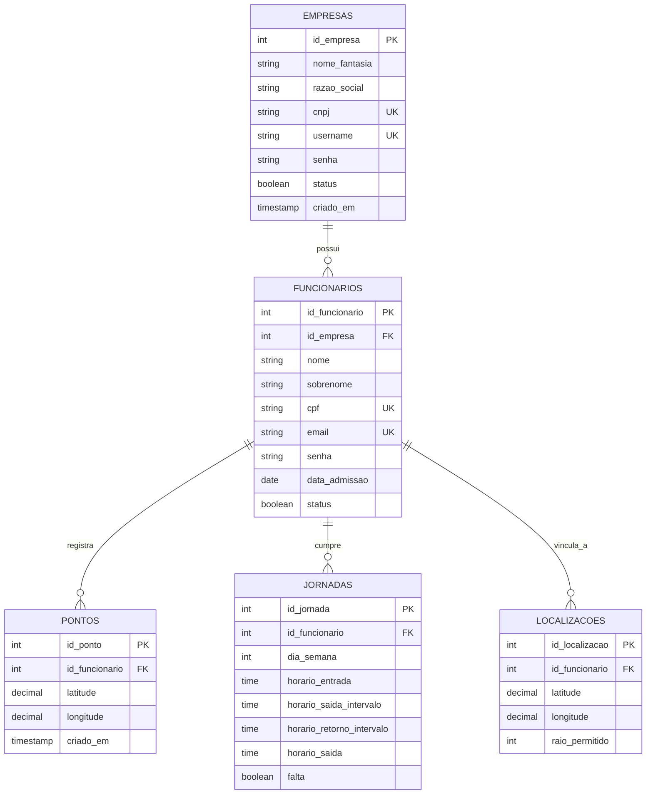

# Backend - GeoPonto API

Este diretório contém o código-fonte da API do sistema GeoPonto, desenvolvida em Python com o framework Flask.

## 🚀 Tecnologias Principais

*   **Linguagem:** Python 3
*   **Framework:** Flask
*   **Banco de Dados:** PostgreSQL
*   **Driver de Conexão:** `psycopg2-binary`
*   **Gerenciamento de Ambiente:** `python-dotenv`
*   **Inteligência Artificial:** `TensorFlow` (Keras) para extração de embeddings faciais
*   **CORS:** `Flask-Cors`
*   **Servidor WSGI:** `gunicorn`

## 🗄️ Modelagem do Banco de Dados

### Diagrama Entidade-Relacionamento (ERD)



### Dicionário de Dados (Principais Tabelas)

| Tabela | Descrição |
| :--- | :--- |
| `empresas` | Dados cadastrais das empresas contratantes. |
| `funcionarios` | Informações dos colaboradores e credenciais de acesso. |
| `pontos` | Registros históricos de batidas de ponto com geolocalização. |
| `jornadas` | Configurações de horários de trabalho previstos por dia da semana. |
| `localizacoes` | Regras de geofencing (raio permitido) por funcionário. |

### Regras de Negócio Implementadas
1.  **Geofencing:** O sistema valida se a distância entre o ponto batido (`pontos`) e o centro permitido (`localizacoes`) é menor ou igual ao `raio_permitido`.
2.  **Integridade de Acesso:** Funcionários são vinculados obrigatoriamente a uma empresa (`id_empresa`).
3.  **Gestão de Status:** Registros desativados (`status = FALSE`) são preservados para fins de auditoria histórica, mas impedidos de realizar novos logins.

## 🛠️ Configuração do Ambiente de Desenvolvimento

1.  **Crie um Ambiente Virtual:**
    ```bash
    python -m venv venv
    ```

2.  **Ative o Ambiente Virtual:**
    *   No Linux/macOS: `source venv/bin/activate`
    *   No Windows: `.\venv\Scripts\activate`

3.  **Instale as Dependências:**
    ```bash
    pip install -r requirements.txt
    ```

## ⚙️ Configuração na VM Azure

A configuração agora é totalmente automatizada para facilitar o deploy.

### 0. Clonagem Estratégica (Sparse Checkout)
Para economizar espaço e recursos na VM, clone apenas o necessário (Backend e Modelo de Biometria) utilizando a técnica de *Sparse Checkout*:

```bash
# 1. Crie a pasta do projeto e inicie o git
mkdir GeoPonto && cd GeoPonto
git init
git remote add origin https://github.com/DanBenedetti/GeoPonto

# 2. Ative o Sparse Checkout
git config core.sparseCheckout true

# 3. Defina as pastas/arquivos necessários
echo "backend/" >> .git/info/sparse-checkout
echo "Biometria/modelo_final_homologado.keras" >> .git/info/sparse-checkout

# 4. Puxe os arquivos da branch principal
git pull origin main
```
*Nota: A estrutura resultante garantirá que o backend encontre o modelo de biometria na pasta vizinha, conforme esperado pelo código.*

### 1. Preparação e Instalação
Acesse a pasta do backend e execute o script de configuração automática:
```bash
cd backend
chmod +x setup_vm.sh back.sh stop.sh
./setup_vm.sh
```

### 2. ▶️ Como Rodar a Aplicação

Para iniciar o servidor em **segundo plano** (ele continuará rodando mesmo se você fechar o terminal):
```bash
./back.sh
```
*   **Logs:** As mensagens do servidor ficam salvas em `backend.log`.
*   **Porta:** O servidor roda na porta `5000`.

Para **parar** o servidor:
```bash
./stop.sh
```

---

## 📋 Endpoints da API

Documentação detalhada de todos os endpoints disponíveis.

### Autenticação

---

#### Login da Empresa
*   **Método:** `POST`
*   **Path:** `/login/empresa`
*   **Descrição:** Autentica um empregador e retorna um token de acesso.
*   **Corpo da Requisição:**
    ```json
    {
        "username": "techsolutions",
        "senha": "senha_segura"
    }
    ```
*   **Resposta de Sucesso (200):**
    ```json
    {
        "token": "dummy-token",
        "id_empresa": 1
    }
    ```

#### Login do Funcionário
*   **Método:** `POST`
*   **Path:** `/login/funcionario`
*   **Descrição:** Autentica um funcionário e retorna um token e seus IDs.
*   **Corpo da Requisição:**
    ```json
    {
        "email": "joao.silva@example.com",
        "senha": "outra_senha_segura"
    }
    ```
*   **Resposta de Sucesso (200):**
    ```json
    {
        "token": "dummy-token-funcionario",
        "id_funcionario": 1,
        "id_empresa": 1
    }
    ```

### Biometria Facial

---

#### Extração de Embeddings
*   **Método:** `POST`
*   **Path:** `/biometry/extract`
*   **Descrição:** Recebe uma imagem facial e retorna um vetor numérico (embedding) de 128 posições gerado pelo modelo MobileNetV3. Este embedding é utilizado para comparação 1:1 no dispositivo móvel.
*   **Corpo da Requisição (Multipart/Form-Data):**
    *   `image`: Arquivo de imagem (JPG/PNG).
*   **Resposta de Sucesso (200):**
    ```json
    {
        "embedding": [0.123, -0.456, ..., 0.789]
    }
    ```
*   **Notas Técnicas:** 
    *   O modelo é carregado como um Singleton no servidor para otimizar memória.
    *   A imagem é redimensionada para 224x224 antes da inferência.

### Empresas

---

#### Criar Empresa
*   **Método:** `POST`
*   **Path:** `/empresas`
*   **Descrição:** Cria uma nova empresa.
*   **Corpo da Requisição:**
    ```json
    {
        "nome_fantasia": "Tech Solutions",
        "razao_social": "Tech Solutions Ltda.",
        "cnpj": "12.345.678/0001-99",
        "senha": "senha_segura",
        "cep": "12345-678",
        "logradouro": "Rua dos Desenvolvedores",
        "numero": "123",
        "bairro": "Centro",
        "cidade": "São Paulo",
        "estado": "SP",
        "pais": "Brasil",
        "username": "techsolutions"
    }
    ```
*   **Resposta de Sucesso (201):**
    ```json
    {
        "message": "Empresa created successfully"
    }
    ```

#### Listar Todas as Empresas
*   **Método:** `GET`
*   **Path:** `/empresas`
*   **Descrição:** Retorna uma lista de todas as empresas.
*   **Resposta de Sucesso (200):**
    ```json
    {
        "empresas": [
            [
                1,
                "Tech Solutions",
                "Tech Solutions Ltda.",
                "12.345.678/0001-99",
                "senha_segura",
                "12345-678",
                "Rua dos Desenvolvedores",
                "123",
                "Centro",
                "São Paulo",
                "SP",
                "Brasil",
                true,
                "2025-11-07T12:00:00",
                "2025-11-07T12:00:00"
            ]
        ]
    }
    ```

#### Obter Detalhes da Empresa
*   **Método:** `GET`
*   **Path:** `/empresas/<id>`
*   **Descrição:** Retorna os detalhes de uma empresa específica.
*   **Resposta de Sucesso (200):**
    ```json
    {
        "empresa": [
            1,
            "Tech Solutions",
            "Tech Solutions Ltda.",
            "12.345.678/0001-99",
            "senha_segura",
            "12345-678",
            "Rua dos Desenvolvedores",
            "123",
            "Centro",
            "São Paulo",
            "SP",
            "Brasil",
            true,
            "2025-11-07T12:00:00",
            "2025-11-07T12:00:00"
        ]
    }
    ```

#### Atualizar Empresa
*   **Método:** `PUT`
*   **Path:** `/empresas/<id>`
*   **Descrição:** Atualiza os dados de uma empresa.
*   **Corpo da Requisição:**
    ```json
    {
        "nome_fantasia": "New Tech Solutions",
        "razao_social": "New Tech Solutions Ltda.",
        "cnpj": "12.345.678/0001-99",
        "cep": "12345-678",
        "logradouro": "Nova Rua dos Desenvolvedores",
        "numero": "456",
        "bairro": "Novo Centro",
        "cidade": "São Paulo",
        "estado": "SP",
        "pais": "Brasil"
    }
    ```
*   **Resposta de Sucesso (200):**
    ```json
    {
        "message": "Empresa updated successfully"
    }
    ```

#### Desativar Empresa
*   **Método:** `DELETE`
*   **Path:** `/empresas/<id>`
*   **Descrição:** Desativa uma empresa (define `status` como `FALSE`).
*   **Resposta de Sucesso (200):**
    ```json
    {
        "message": "Empresa deleted successfully"
    }
    ```

### Funcionários

---

#### Criar Funcionário
*   **Método:** `POST`
*   **Path:** `/funcionarios`
*   **Descrição:** Cadastra um novo funcionário para uma empresa.
*   **Corpo da Requisição:**
    ```json
    {
        "id_empresa": 1,
        "nome": "João",
        "sobrenome": "Silva",
        "cpf": "123.456.789-00",
        "rua": "Rua do Comércio",
        "numero": "456",
        "bairro": "Centro",
        "cidade": "São Paulo",
        "cep": "12345-678",
        "email": "joao.silva@example.com",
        "telefone": "11987654321",
        "cargo": "Desenvolvedor",
        "senha": "outra_senha_segura",
        "data_admissao": "2023-01-15"
    }
    ```
*   **Resposta de Sucesso (201):**
    ```json
    {
        "message": "Funcionario created successfully"
    }
    ```

#### Listar Funcionários da Empresa
*   **Método:** `GET`
*   **Path:** `/funcionarios?id_empresa=<id_empresa>`
*   **Descrição:** Lista todos os funcionários de uma empresa específica.
*   **Resposta de Sucesso (200):**
    ```json
    {
        "funcionarios": [
            {
                "id_funcionario": 1,
                "id_empresa": 1,
                "nome": "João",
                "sobrenome": "Silva",
                "cpf": "123.456.789-00",
                "rua": "Rua do Comércio",
                "numero": "456",
                "bairro": "Centro",
                "cidade": "São Paulo",
                "cep": "12345-678",
                "email": "joao.silva@example.com",
                "telefone": "11987654321",
                "cargo": "Desenvolvedor",
                "data_admissao": "2023-01-15T00:00:00",
                "senha": "...",
                "status": true,
                "criado_em": "2025-11-07T12:30:00",
                "atualizado_em": "2025-11-07T12:30:00"
            }
        ]
    }
    ```

#### Obter Detalhes do Funcionário
*   **Método:** `GET`
*   **Path:** `/funcionarios/<id>`
*   **Descrição:** Retorna os detalhes de um funcionário específico.
*   **Resposta de Sucesso (200):**
    ```json
    {
        "id_funcionario": 1,
        "id_empresa": 1,
        "nome": "João",
        "sobrenome": "Silva",
        "cpf": "123.456.789-00",
        "rua": "Rua do Comércio",
        "numero": "456",
        "bairro": "Centro",
        "cidade": "São Paulo",
        "cep": "12345-678",
        "email": "joao.silva@example.com",
        "telefone": "11987654321",
        "cargo": "Desenvolvedor",
        "data_admissao": "2023-01-15T00:00:00",
        "senha": "...",
        "status": true,
        "criado_em": "2025-11-07T12:30:00",
        "atualizado_em": "2025-11-07T12:30:00"
    }
    ```

#### Atualizar Funcionário
*   **Método:** `PUT`
*   **Path:** `/funcionarios/<id>`
*   **Descrição:** Atualiza os dados de um funcionário. Apenas os campos a serem alterados precisam ser enviados.
*   **Corpo da Requisição:**
    ```json
    {
        "cargo": "Desenvolvedor Sênior",
        "telefone": "11999998888"
    }
    ```
*   **Resposta de Sucesso (200):**
    ```json
    {
        "message": "Funcionário atualizado com sucesso"
    }
    ```

#### Desativar Funcionário
*   **Método:** `DELETE`
*   **Path:** `/funcionarios/<id>`
*   **Descrição:** Desativa um funcionário (define `status` como `FALSE`).
*   **Resposta de Sucesso (200):**
    ```json
    {
        "message": "Funcionario deleted successfully"
    }
    ```

### Pontos (Registros de Horário)

---

#### Registrar Ponto
*   **Método:** `POST`
*   **Path:** `/ponto/<id_funcionario>`
*   **Descrição:** Cria um novo registro de ponto para um funcionário.
*   **Corpo da Requisição:**
    ```json
    {
        "latitude": -23.550520,
        "longitude": -46.633308
    }
    ```
*   **Resposta de Sucesso (201):**
    ```json
    {
        "message": "Ponto created successfully"
    }
    ```

#### Listar Pontos do Funcionário
*   **Método:** `GET`
*   **Path:** `/ponto/funcionario/<id_funcionario>?month=<mes>&year=<ano>`
*   **Descrição:** Lista todos os registros de ponto de um funcionário, agrupados por dia, para um determinado mês/ano.
*   **Resposta de Sucesso (200):**
    ```json
    [
        {
            "data": "2025-11-07",
            "registros": [
                {
                    "time": "09:01:15",
                    "latitude": -23.550520,
                    "longitude": -46.633308
                },
                {
                    "time": "12:05:30",
                    "latitude": -23.550521,
                    "longitude": -46.633309
                },
                {
                    "time": "13:02:00",
                    "latitude": -23.550520,
                    "longitude": -46.633308
                },
                {
                    "time": "18:00:45",
                    "latitude": -23.550521,
                    "longitude": -46.633309
                }
            ]
        }
    ]
    ```

#### Deletar Registro de Ponto
*   **Método:** `DELETE`
*   **Path:** `/ponto/funcionario/<id_ponto>`
*   **Descrição:** Deleta um registro de ponto específico.
*   **Resposta de Sucesso (200):**
    ```json
    {
        "message": "Ponto deleted successfully"
    }
    ```

### Jornadas de Trabalho

---

#### Criar/Atualizar Jornada
*   **Método:** `POST`
*   **Path:** `/jornadas`
*   **Descrição:** Cria ou atualiza a jornada de trabalho de um funcionário. As jornadas existentes para o funcionário são substituídas.
*   **Corpo (Jornada Padrão):**
    ```json
    {
        "id_funcionario": 1,
        "jornada_diferenciada": false,
        "dias_semana": [1, 2, 3, 4, 5],
        "horario_entrada": "09:00",
        "horario_saida_intervalo": "12:00",
        "horario_retorno_intervalo": "13:00",
        "horario_saida": "18:00"
    }
    ```
*   **Corpo (Jornada Diferenciada):**
    ```json
    {
        "id_funcionario": 1,
        "jornada_diferenciada": true,
        "dias": [
            {
                "dia_semana": 1,
                "horario_entrada": "09:00",
                "horario_saida": "17:00"
            },
            {
                "dia_semana": 2,
                "horario_entrada": "08:00",
                "horario_saida_intervalo": "12:00",
                "horario_retorno_intervalo": "13:00",
                "horario_saida": "17:00"
            }
        ]
    }
    ```
*   **Resposta de Sucesso (201):**
    ```json
    {
        "message": "Jornadas created successfully"
    }
    ```

#### Obter Jornadas do Funcionário
*   **Método:** `GET`
*   **Path:** `/jornadas/funcionario/<id_funcionario>?day_of_week=<dia>`
*   **Descrição:** Retorna a(s) jornada(s) de um funcionário. Opcionalmente, filtra por um dia da semana específico (0=Domingo, 1=Segunda, ...).
*   **Resposta de Sucesso (200):**
    ```json
    {
        "jornadas": [
            {
                "id_jornada": 1,
                "id_funcionario": 1,
                "dia_semana": 1,
                "horario_entrada": "09:00:00",
                "horario_saida_intervalo": "12:00:00",
                "horario_retorno_intervalo": "13:00:00",
                "horario_saida": "18:00:00",
                "ocorrencia": null,
                "falta": null,
                "criado_em": "2025-11-07T13:00:00",
                "atualizado_em": "2025-11-07T13:00:00"
            }
        ]
    }
    ```

#### Atualizar Jornada
*   **Método:** `PUT`
*   **Path:** `/jornadas/<id_jornada>`
*   **Descrição:** Atualiza os dados de uma jornada específica.
*   **Resposta de Sucesso (200):** `{"message": "Jornada atualizada com sucesso"}`

#### Deletar Jornada
*   **Método:** `DELETE`
*   **Path:** `/jornadas/<id_jornada>`
*   **Descrição:** Remove uma jornada específica.
*   **Resposta de Sucesso (200):** `{"message": "Jornada deleted successfully"}`

### Localizações Permitidas

---

#### Criar Localização
*   **Método:** `POST`
*   **Path:** `/localizacoes`
*   **Descrição:** Define uma localização permitida e um raio para o registro de ponto de um funcionário.
*   **Corpo da Requisição:**
    ```json
    {
        "id_funcionario": 1,
        "latitude": -23.550520,
        "longitude": -46.633308,
        "raio_permitido": 100
    }
    ```
*   **Resposta de Sucesso (201):**
    ```json
    {
        "message": "Localizacao created successfully"
    }
    ```

#### Obter Localização do Funcionário
*   **Método:** `GET`
*   **Path:** `/localizacoes/funcionario/<id_funcionario>`
*   **Descrição:** Retorna a localização configurada para um funcionário.
*   **Resposta de Sucesso (200):**
    ```json
    {
        "localizacao": {
            "id_localizacao": 1,
            "id_funcionario": 1,
            "latitude": -23.550520,
            "longitude": -46.633308,
            "raio_permitido": 100,
            "criado_em": "2025-11-07T14:00:00",
            "atualizado_em": "2025-11-07T14:00:00"
        }
    }
    ```

#### Atualizar Localização
*   **Método:** `PUT`
*   **Path:** `/localizacoes/<id_localizacao>`
*   **Descrição:** Atualiza as coordenadas ou o raio de uma localização.
*   **Resposta de Sucesso (200):** `{"message": "Localizacao updated successfully"}`

#### Deletar Localização
*   **Método:** `DELETE`
*   **Path:** `/localizacoes/<id_localizacao>`
*   **Descrição:** Remove uma configuração de localização.
*   **Resposta de Sucesso (200):** `{"message": "Localizacao deleted successfully"}`

### Relatórios e Análises

---

#### Relatório de Horas Trabalhadas
*   **Método:** `GET`
*   **Path:** `/relatorios/horas-trabalhadas/funcionario/<id_funcionario>`
*   **Descrição:** Retorna o histórico de pontos para cálculo de horas. (Em implementação).

#### Relatório de Faltas (Geral)
*   **Método:** `GET`
*   **Path:** `/relatorios/faltas/funcionario/<id_funcionario>`
*   **Descrição:** Endpoint auxiliar para geração de relatório de absenteísmo. (Em implementação).

#### Listar Faltas do Funcionário (Últimos 40 dias)
*   **Método:** `GET`
*   **Path:** `/funcionarios/<id_funcionario>/faltas`
*   **Descrição:** Retorna uma lista de datas em que um funcionário deveria ter trabalhado (com base na sua jornada), mas não registrou ponto. A análise cobre os últimos 40 dias.
*   **Resposta de Sucesso (200):**
    ```json
    {
        "faltas": [
            "2025-10-20",
            "2025-10-27"
        ]
    }
    ```

### Status e Analytics

---

#### Status do Banco de Dados
*   **Método:** `GET`
*   **Path:** `/db-status`
*   **Descrição:** Retorna o status da conexão com o banco de dados e estatísticas das tabelas.
*   **Resposta de Sucesso (200):**
    ```json
    {
        "database_name": "geoponto_db",
        "status": "connected",
        "tables": [
            { "table_name": "empresas", "record_count": 1 },
            { "table_name": "funcionarios", "record_count": 5 },
            { "table_name": "pontos", "record_count": 120 },
            { "table_name": "jornadas", "record_count": 25 },
            { "table_name": "localizacoes", "record_count": 5 }
        ],
        "ddl_example": "CREATE TABLE Funcionarios (...);",
        "dml_example": "INSERT INTO Funcionarios (...) VALUES (...);"
    }
    ```

#### Registrar Visualização de Página (Analytics)
*   **Método:** `POST`
*   **Path:** `/analytics/page-view`
*   **Descrição:** Endpoint para o frontend registrar uma visualização de página.
*   **Corpo da Requisição:**
    ```json
    {
        "page_name": "/home_funcionario",
        "render_time_ms": 150
    }
    ```

#### Registrar Clique em Botão (Analytics)
*   **Método:** `POST`
*   **Path:** `/analytics/button-click`
*   **Descrição:** Endpoint para o frontend registrar um clique em um botão.
*   **Corpo da Requisição:**
    ```json
    {
        "button_id": "bater_ponto_btn",
        "page_name": "/home_funcionario"
    }
    ```

#### Obter Métricas de Analytics
*   **Método:** `GET`
*   **Path:** `/analytics/metrics`
*   **Descrição:** Retorna métricas agregadas de uso da aplicação.
*   **Resposta de Sucesso (200):**
    ```json
    {
        "most_accessed_pages": [
            { "page_name": "/home_funcionario", "view_count": 150 },
            { "page_name": "/login", "view_count": 80 }
        ],
        "most_clicked_buttons": [
            { "button_id": "bater_ponto_btn", "click_count": 120 },
            { "button_id": "ver_espelho_ponto", "click_count": 95 }
        ],
        "slowest_pages": [
            { "page_name": "/relatorio_mensal", "avg_render_time": 450.5 },
            { "page_name": "/analytics_dashboard", "avg_render_time": 320.0 }
        ]
    }
    ```
